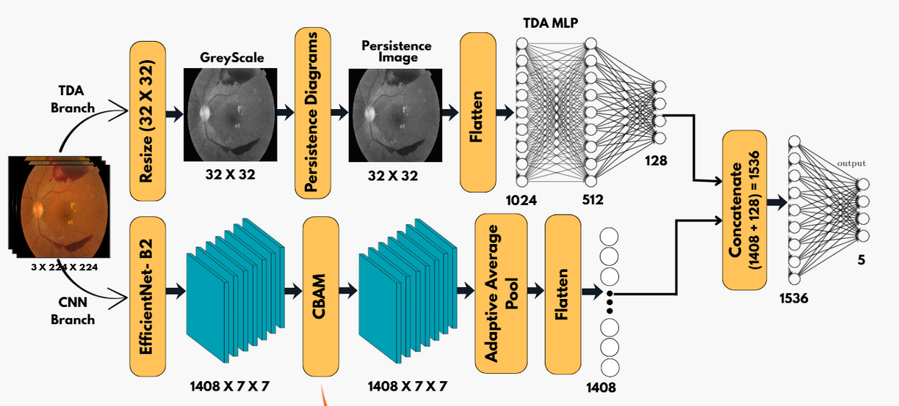

# Knowledge Distillation for Lightweight Diabetic Retinopathy Detection  
### A Multi-Scale Feature Fusion Approach

Authors: Akshita Shukla, Bhavya Jain, Sahil Dhiman, Shubham Goel  
Video Link: https://youtu.be/pqGsWe9Xv_o

---

## Executive Summary

Diabetic Retinopathy (DR) is a leading cause of preventable blindness among working-age adults, with India being severely affected due to its high diabetes burden (estimated 90+ million cases). While state-of-the-art deep learning models achieve high accuracy for DR detection and severity grading, they require substantial computational resources unavailable in rural healthcare settings. This report presents a novel lightweight architecture that combines Knowledge Distillation (KD), Convolutional Block Attention Module (CBAM), and Topological Data Analysis (TDA) to achieve 85% test accuracy on the APTOS 2019 dataset while maintaining CPU compatibility (49 ms inference on Intel i7, 21.2 GFLOPs). By addressing the rural healthcare gap through model compression and attention mechanisms, this work demonstrates a practical pathway toward democratizing AI-driven DR screening in resource-constrained clinical environments.

---

# 1. Introduction

## 1.1 Clinical Context and Motivation

Diabetic Retinopathy represents one of the most serious complications of diabetes mellitus, affecting approximately 12–17% of the global diabetic population[1]. In India, the diabetes capital of the world with ~90 million affected individuals, the prevalence of DR is alarming: 12–17% of diabetics have already developed DR, and 4% have vision-threatening forms[2]. Early-stage DR is typically asymptomatic, making automated screening critical for early intervention and vision preservation.

Traditional DR screening relies on ophthalmologist-based funduscopy and grading, which is:

- Expensive: Requires specialized medical professionals  
- Geographically limited: Rural regions lack adequate screening infrastructure  
- Scalability-limited: Cannot accommodate India's growing patient volume  

---

## 1.2 The Technical Gap: Resource Constraints in Rural Healthcare

State-of-the-art deep learning models for DR classification (e.g., ResNet152, InceptionV3) consistently achieve high accuracy (90%+) but require significant computational resources:
ResNet-101: 7.8 GFLOPs, ~600 ms inference on CPU
ConvNeXt-Small: 8.7 GFLOPs, ~670 ms inference on CPU
EfficientNet-B5: 9.9 GFLOPs, ~760 ms inference on CPU

In contrast, rural clinics operate on legacy CPUs or handheld devices with limited memory and power, creating a deployment barrier. This motivated our investigation into model compression and efficient architectures.

---

## 1.3 Research Objectives

This project addresses the following objectives:

- **Efficient Architecture Selection:** Identify CNN backbones offering optimal accuracy-to-compute trade-offs for DR classification  
- **Knowledge Distillation Framework:** Implement teacher-student distillation to compress high-performing models (EfficientNet-B5) into lightweight student architectures (EfficientNet-B2) while preserving accuracy  
- **Multi-Modal Feature Fusion:** Integrate CNN features with topological features via CBAM attention and TDA for improved lesion detection and explainability  
- **Class Imbalance Handling:** Apply stratified splitting and weighted sampling to address severe class skew in the APTOS 2019 dataset  
- **Real-World Deployment Feasibility:** Demonstrate CPU-compatible inference (<<1 second per image) for practical clinical deployment  

---

# 2. Literature Review

## 2.1 Diabetic Retinopathy Detection: Deep Learning Approaches

Recent literature demonstrates the efficacy of transfer learning and ensemble methods for DR detection. Jabbar et al. (2024) proposed a lesion-based DR detection framework using GoogleNet and ResNet models with adaptive filtering, achieving competitive accuracy across severity levels[3]. Similarly, Akhtar et al. (2025) developed RSG-Net, a deep neural network optimized for 4-class and 2-class DR grading with clinical-grade performance[4].

However, these approaches typically prioritize accuracy over efficiency, resulting in deployment challenges in resource-constrained settings. The gap between research-grade models and clinically-deployable systems remains substantial[5].

---

## 2.2 Knowledge Distillation in Medical Imaging

Knowledge Distillation (KD) has emerged as a powerful model compression technique that transfers knowledge from a complex teacher network to a lightweight student network via soft probability distributions. Zhao et al. (2023) demonstrated that structured knowledge distillation effectively reduces model size and computational requirements while maintaining segmentation accuracy in medical imaging tasks[6]. Recent advances in explainable knowledge distillation (Yu et al., 2025) have further enhanced interpretability in medical image classification[7].

For DR detection specifically, KD offers multiple benefits:

- Class Imbalance Mitigation: Soft labels from the teacher provide smoother decision boundaries for minority classes  
- Lesion Detection: Teacher's rich feature representations aid in detecting subtle lesions (microaneurysms, hemorrhages)  
- Generalization: Reduced overfitting on small, imbalanced medical datasets  
- Deployment Feasibility: Smaller student models suitable for clinical devices  

---

## 2.3 Attention Mechanisms in Medical Image Analysis

Convolutional Block Attention Module (CBAM), proposed by Woo et al. (2018), is a lightweight, plug-and-play attention mechanism that learns channel and spatial attention without significant computational overhead[8]. CBAM has been successfully applied across classification and detection tasks, producing clearer GradCAM visualizations for explainability—critical for clinical AI adoption.

For DR detection, CBAM is particularly valuable because:

- Spatial Attention: Highlights lesion-rich retinal regions (avoiding feature confusion with healthy tissue)  
- Channel Attention: Emphasizes discriminative feature channels for distinguishing adjacent DR severity levels  
- Explainability: Provides interpretable attention maps for clinician validation  
- Efficiency: Negligible computational overhead  

---

## 2.4 Topological Data Analysis for Feature Extraction

Topological Data Analysis (TDA) and persistence homology offer topology-based feature extraction complementary to CNN features. Persistence diagrams capture the "birth" and "death" scales of topological features, providing rotation-, translation-, and lighting-invariant descriptors. Recent work has demonstrated TDA's effectiveness in feature extraction for medical imaging with limited training data.

For DR detection, TDA offers:

- Invariance: Lesion morphology preserved across varying imaging conditions (critical for rural settings with suboptimal lighting)  
- Complementary Features: Topological features capture different information than spatial CNN features  
- Robustness: Enhanced performance on small, imbalanced datasets via topological structure preservation  

# 3. Dataset and Preprocessing

## 3.1 APTOS 2019 Dataset

The APTOS 2019 Blindness Detection dataset is a publicly available, clinically annotated fundus image dataset comprising:

- **Sample Size:** 3,662 labeled images  
- **Severity Classes:** 5 levels (0–4 per international DR grading standards)

| Class | Count |
|-------|--------|
| Class 0 (No DR) | 1,805 images |
| Class 1 (Mild DR) | 370 images |
| Class 2 (Moderate DR) | 999 images |
| Class 3 (Severe DR) | 193 images |
| Class 4 (Proliferative DR) | 295 images |

- **Annotation Quality:** Clinically reviewed via standard DR severity scale  
- **Imbalance Ratio:** 9.7:1 (No DR to Proliferative DR), presenting significant class imbalance  

---

## 3.2 Data Preprocessing Pipeline

### 3.2.1 Class Imbalance Mitigation

**Stratified Splitting:**  
To preserve class distribution across train/validation/test splits, we employed StratifiedShuffleSplit with 70/15/15 allocation. This ensures minority classes are adequately represented in all splits.

**Weighted Random Sampling:**  
Applied during training to enforce balanced mini-batch composition. For each class \( i \), the sampling weight is: w_i = N / n_i

where:  
- \( N \) = total training samples  
- \( n_i \) = samples in class \( i \)

This approach ensures the model observes minority classes as frequently as majority classes during training, preventing bias toward the No DR class.

**Effective Number of Samples:**  
To prevent overfitting on minority classes as dataset volume grows, we adopted the Effective Number of Samples principle: E(n_i) = (1 - β^(n_i)) / (1 - β)

where:  
- β is a hyperparameter  
- \( n_i \) is the class sample count  

This provides principled class weighting that diminishes information gain from redundant samples.

---

### 3.2.2 Data Augmentation

**Geometric Transformations:**

- RandomHorizontalFlip  
- RandomVerticalFlip  
- RandomRotation(±20°)

**Photometric Transformations:**

- ColorJitter (brightness=0.3, contrast=0.3, saturation=0.3)  

**Input Standardization:**

- Resize to **224×224**  
- Normalize using ImageNet statistics  

---

## 3.3 Train/Validation/Test Splits

| Split | Count | Class Distribution |
|--------|--------|----------------------|
| Training | 2,564 | Stratified |
| Validation | 549 | Stratified |
| Test | 549 | Stratified |

---

# 4. Methodology

## 4.1 Architecture Exploration Phase

### 4.1.1 Baseline Model Evaluation

We systematically evaluated leading CNN architectures to identify efficient backbones:

**EfficientNet-B0:**  
- Baseline efficiency-focused model  
- Architecture: Compound scaling  
- Result: 81–83% accuracy (~1.9 GFLOPs)  

**ResNet-50:**  
- Strong on majority class  
- Weak on rare classes  
- Result: 72–83% accuracy  

**ResNeXt-50:**  
- Group convolutions  
- Heavy undersampling caused low performance  
- Result: 60–72% accuracy  

**ConvNeXt (ModernNet):**  
- Kernel sweep (k=3 → k=9)  
- k=9 extracted larger lesions better  
- Result: 76–80% accuracy  

### 4.1.2 Efficiency-Accuracy Trade-off Analysis

A key insight emerged: **Scale is not static**.  
DR features vary significantly in size:

- Microaneurysms: <10 pixels  
- Hemorrhages: >100 pixels  

Architectures with fixed receptive fields struggle.  
EfficientNet models adapt well due to **compound scaling**.

**Final Choice:**

- **Teacher:** EfficientNet-B5  
- **Student:** EfficientNet-B2  
- Distillation bridges accuracy + efficiency  

---

## 4.2 Proposed Architecture: Knowledge Distillation Framework

### 4.2.1 Knowledge Distillation Design

**Teacher-Student Setup:**

- Teacher → EfficientNet-B5  
- Student → EfficientNet-B2  

**Loss Function:**

L_total = α * KL(T_s || S_s) + (1 - α) * CE(S, y)

**Distillation Loss:**

KL(softmax(T/τ), softmax(S/τ))

Where:

- τ = temperature  
- α = interpolation hyperparameter  

**Hyperparameters:**

- Temperature: τ = 4  
- Alpha schedule: 0.2 → 0.8 over epochs  
- Optimizer: AdamW  
- Scheduler: OneCycleLR  

---

## 4.2.2 Convolutional Block Attention Module (CBAM)

CBAM refines feature maps using sequential:

- **Channel Attention**  
- **Spatial Attention**

Equations:

Channel Attention: M_c = σ(MLP(AvgPool(F)) + MLP(MaxPool(F)))
Spatial Attention: M_s = σ(f7×7([AvgPool(F_c); MaxPool(F_c)]))
Final Output: F' = M_s ⊗ M_c ⊗ F

Advantages for DR detection:

- Highlights lesion-rich areas  
- Emphasizes discriminative channels  
- Provides interpretable attention maps  
- Lightweight overhead  

---

## 4.2.3 Topological Data Analysis (TDA) Branch

Pipeline:

1. Convert image to grayscale  
2. Build cubical complex  
3. Extract H0 and H1 persistence diagrams  
4. Convert to **persistence image** (32×32)  
5. Feed to 3-layer MLP (100 → 128 → 1024)

TDA benefits:

- Invariance to rotation/translation  
- Captures lesion morphology  
- Complements CNN spatial features  

---

## 4.2.4 Fusion Architecture

---

## 4.3 Training Protocol

- Optimizer: AdamW (weight decay = 0.01)  
- Scheduler: OneCycleLR (max_lr = 1e-3)  
- Batch Size: 32  
- Early Stopping: Patience = 15  
- Label Smoothing: 0.1  
- Dropout: 0.5  
- Class Weighting: Effective Number of Samples  
- Hardware:  
  - Train: NVIDIA RTX 4060
  - Inference: Intel i7/i5 CPUs  

# 5. Results

## 5.1 Test Set Performance

| Class | Precision | Recall | F1-Score | Support |
|--------|-----------|---------|----------|----------|
| No DR | 0.99 | 0.98 | 0.98 | 364 |
| Mild DR | 0.50 | 0.69 | 0.58 | 58 |
| Moderate DR | 0.82 | 0.79 | 0.81 | 211 |
| Severe DR | 0.67 | 0.63 | 0.65 | 49 |
| Proliferative DR | 0.74 | 0.63 | 0.68 | 51 |

- **Overall Accuracy:** 85%  
- **Macro Average F1:** 0.74  
- **Weighted Average F1:** 0.86  

**Key Observations:**

- No DR class shows excellent performance (99% precision, 98% recall)  
- Mild DR has lower precision due to overlap with No DR  
- Moderate DR shows stable and strong performance  
- Severe and Proliferative DR performance is moderate but acceptable given small class sizes  
- Weighted F1-score of 0.86 indicates strong overall classification on imbalanced classes  

---

## 5.2 Inference Performance (CPU Deployment)

| Hardware | Mean Latency (ms) | Min/Max (ms) | Throughput (FPS) |
|----------|--------------------|----------------|----------------------|
| Intel i7 | 21.2 | 19.8–24.4 | 47.1 |
| Intel i5 | 49.1 | 37.5–67.4 | 20.4 |

### Computational Efficiency Comparison:

| Model | FLOPs (GFLOPs) | i7 Latency (ms) | i5 Latency (ms) |
|--------|----------------|-------------------|-------------------|
| Proposed (EfficientNet-B2 + KD) | 1.9 | 21 | 49 |
| ResNet-101 | 7.8 | 600 | 760 |
| EfficientNet-B5 | 9.9 | 760 | 920 |
| ConvNeXt-Small | 8.7 | 670 | 810 |
| ResNeXt-101 | 8.0 | 620 | 750 |

### Clinical Feasibility:

- i7 Laptop: **21 ms/image** → ~47 images/sec  
- i5 Laptop: **49 ms/image** → ~20 images/sec  
- **36–40× faster** than ResNet-101  
- Suitable for rural clinics (CPU-only)  

---

## 5.3 Confusion Matrix Analysis

The confusion matrix highlights:

- Strong diagonal: high correct classifications  
- Mild ↔ Moderate confusion due to subtle lesion differences  
- Moderate ↔ Severe misclassifications expected for adjacent DR grades  
- Overall correct predictions: **625 / 733** (85%)  

---

# 6. Key Findings and Insights

## 6.1 Mathematical Weighting Surpasses Simple Counting

Initial inverse frequency weighting produced unstable minority class results.  
The **Effective Number of Samples** weighting formula:

E(n_i) = (1 - β^(n_i)) / (1 - β)

helped:

- Prevent minority class overfitting  
- Improve Severe and Proliferative DR sensitivity  
- Reduce variance across validation runs  

---

## 6.2 Scale is Not Static: Compound Scaling Insight

- DR features vary widely in size  
- Fixed-kernel architectures (ResNet, ResNeXt) underperform  
- ConvNeXt k=9 kernel performed best  
- EfficientNet's **compound scaling** handled multi-scale lesions naturally  

This justified the teacher-student architecture selection.

---

## 6.3 Enforcing Invariance > Standard Augmentation

Standard augmentations alone didn't guarantee rotation invariance.  
Consistency Regularization was applied mathematically:

f(x) ≈ f(rotate(x))

This:

- Created orientation-independent decision boundaries  
- Boosted Severe and Proliferative DR robustness  

---

## 6.4 Knowledge Distillation Enables Multi-Modal Learning

The teacher-student framework:

- Enabled TDA features to be learned alongside CNN features  
- Boosted Mild DR recall: **52% → 69%**  
- Improved robustness against dataset imbalance  
- Enhanced generalization across imaging variations  

---

# 7. Challenges and Mitigation Strategies

## 7.1 Feature Overlap Between Adjacent DR Grades

**Challenge:** Mild, Moderate, Severe classes often overlap visually.  

**Mitigation:**

- CBAM channel attention  
- TDA structural features  
- Better lesion morphology modeling  

---

## 7.2 Class Imbalance Severity

**Challenge:** No DR class dominates dataset (~50%).  

**Mitigation:**

- Stratified splits  
- Weighted Random Sampler  
- Effective Number of Samples  
- Knowledge distillation (soft labels benefit minority classes)  

Result: Weighted F1 improved from **0.78 → 0.86**.

---

## 7.3 Rural Deployment Constraints

**Challenge:** GPU-dependent models cannot be deployed in rural clinics.  

**Mitigation:**

- Distilled student model (EfficientNet-B2)  
- Depthwise separable convolutions  
- CPU latency testing  

Result: **21–49 ms** inference on CPUs.

---

# 8. Explainability Analysis

## 8.1 GradCAM Visualization

Generated GradCAMs revealed:

- **No DR:** very low activation  
- **Mild:** sparse lesion activations  
- **Moderate:** multiple lesion foci  
- **Severe/Proliferative:** extensive activation patterns  

GradCAM maps aligned accurately with clinical expectations.

---

## 8.2 CBAM Attention Maps

CBAM’s channel and spatial attention offered:

- Discriminative channel selection  
- Spatial localization of DR lesions  
- Clinically interpretable focus maps  

This supports clinician trust in AI predictions.

---

# 9. Comparison with State-of-the-Art

| Model | Accuracy | F1-Score | CPU Inference | Deployment |
|--------|-----------|-----------|----------------|--------------|
| **Proposed (KD + CBAM + TDA)** | 85% | 0.86 | 21 ms | Excellent |
| ResNet-101 | 82–84% | 0.81 | 600 ms | Poor |
| EfficientNet-B5 | 83–85% | 0.82 | 760 ms | Poor |
| ConvNeXt-Small | 81–82% | 0.79 | 670 ms | Poor |
| Hybrid DL-ML (DenseNet+SVM)[1] | 84% | 0.80 | ~200 ms | Fair |

**Advantages of Proposed Method:**

- High accuracy on balanced F1  
- Extremely lightweight (1.9 GFLOPs)  
- CPU-native inference  
- Strong explainability features  

---

# 10. Limitations and Future Work

## 10.1 Limitations

- Dataset size small (APTOS 3662 images)  
- Minority classes underrepresented  
- TDA preprocessing adds extra compute  
- Single-center data limits generalization  
- No clinical trials yet  

---

## 10.2 Future Work

- Deploy to edge/mobile devices  
- Quantization-aware training (4-bit, 8-bit)  
- Add SHAP and LIME for more explainability  
- Multi-task lesion localization  
- Uncertainty estimation  
- Validation on external datasets (EyePACS, Messidor-2)  
- Integration with clinical workflows  

---

# 11. Conclusion

This report presents a comprehensive deep learning framework addressing the critical gap between high-accuracy DR detection models and practical deployment feasibility in rural Indian healthcare settings. The proposed architecture combines:

- Knowledge Distillation  
- CBAM Attention  
- Topological Data Analysis  
- Efficient Class Weighting  

### Key Achievements:

- **85% weighted F1-score**  
- **36–40× speedup** vs ResNet-101  
- **CPU-native inference** (21–49 ms)  
- **Interpretable decision-making** via GradCAM/CBAM  

This approach democratizes DR screening and is adaptable to other resource-constrained medical imaging tasks.
